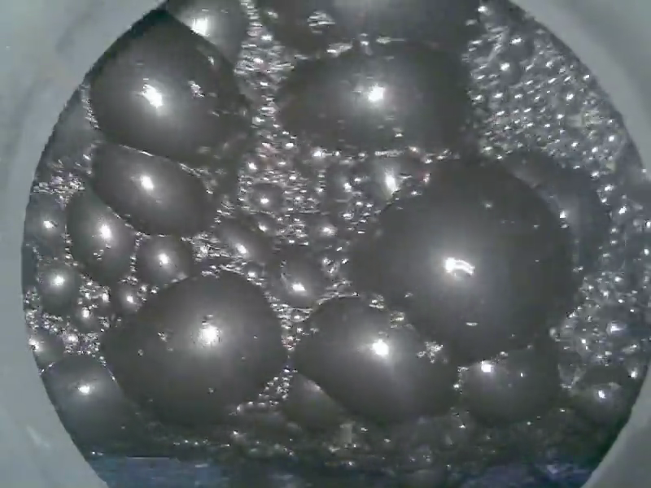

I've taken one class about machine learning applied to engineering at UFSC's master program, and the final project is shown in this folder.

The dataset chosen is [available here](https://www.kaggle.com/datasets/obobojk/froth-bubbles). It is composed of frames of several videos from the industrial froth flotation process, which has applications in metallurgy, water treatment, and waste processing. The grayscale images show the multiphase flow of bubbles. Also, there are available the masks of those bubbles which were generated following the procedure described at [Prokopov et. al (2025)](https://www.scitepress.org/PublishedPapers/2025/131811/). An example of the images and masks of the dataset is shown below.

  
  

My aim for this dataset was to apply classification algorithms (k-means, k-nearest neighbors, AdaBoost classifier, neural networks, and convolutional neural networks) to decide if a given image is composed of larger or smaller bubbles. In order to create the labels used, I've applied `opencv` to identify the bubbles' contour, compute their area, and decide if most of the image area is occupied by the 10 largest bubbles.

